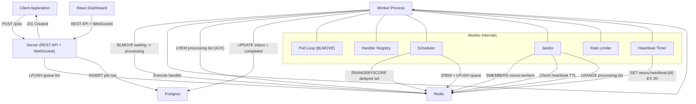

# NexusQueue Architecture

This document provides a deep technical overview of NexusQueue's internals. It is written for engineers evaluating the system, contributing to it, or learning how distributed task queues work.

NexusQueue is a distributed task queue engine that pairs Redis (for real-time speed) with Postgres (for durable audit trails). It uses a pull-based architecture where workers actively fetch jobs from Redis lists, and a dual-write strategy ensures every job lifecycle event is recorded in both stores.

---

## System Overview

NexusQueue consists of four main processes that communicate through Redis and Postgres:

1. **Server** - Express REST API that accepts job submissions and serves the dashboard API
2. **Worker** - Long-running process that pulls jobs from Redis and executes handlers
3. **Scheduler** - Embedded in the worker process; promotes delayed and cron jobs
4. **Janitor** - Embedded in the worker process; detects dead workers and recovers orphaned jobs



The server is stateless and horizontally scalable. Workers are independent processes that can be scaled to any count. Redis acts as the coordination layer (job queues, heartbeats, rate limiting state), while Postgres serves as the durable source of truth for job history and audit.

---

## Data Flow

### Enqueue Path

When a client submits a job via `POST /jobs`, the following sequence occurs:

1. **Validation** - The server validates the request body (jobName, payload, queue are required; priority, maxAttempts, delay, idempotencyKey are optional).
2. **Idempotency Check** - If an idempotencyKey is provided, the server checks Redis for an existing key. If found, it returns the existing job ID without creating a duplicate.
3. **UUID Generation** - A new UUID v4 is generated as the job ID.
4. **Redis Write** - The job ID is pushed onto the appropriate Redis list. For priority queues, the target list is `nexus:queue:{name}:{priority}` (e.g., `nexus:queue:default:normal`). For delayed jobs, the job is added to the sorted set `nexus:delayed:{queue}` with the future timestamp as the score.
5. **Postgres Write** - An INSERT into the `jobs` table records the job with status `pending`, along with all metadata (queue_name, job_name, payload, max_attempts, created_at).
6. **Idempotency Key Set** - If an idempotencyKey was provided, the server sets `nexus:idempotency:{key}` in Redis with a TTL (default 24h).
7. **Response** - The server returns 201 Created with the job ID.

Steps 4-6 are pipelined as a single Redis operation batch to minimize round-trips. The dual-write is not wrapped in a distributed transaction; if Postgres fails after Redis succeeds, the job will exist in the queue but lack an audit record. This trade-off favors availability over strict consistency.

### Dequeue Path

When a worker is ready for work:

1. **BLMOVE** - The worker issues `BLMOVE nexus:queue:{name}:{priority} nexus:processing:{workerId} LEFT RIGHT timeout`. This atomically pops a job ID from the queue list and pushes it onto the worker's processing list. The blocking semantics mean the worker waits (with a timeout) until a job is available, consuming zero CPU while idle.
2. **Priority Scan** - The worker checks priority lists in order: high, then normal, then low. The first non-empty list provides the next job.
3. **Job Metadata Fetch** - The worker retrieves the full job payload from Redis (stored in a hash at `nexus:job:{id}`).
4. **Handler Execution** - The worker looks up the registered handler function for the job's `jobName` and invokes it with the payload.
5. **ACK (Success)** - On successful completion, the worker issues `LREM nexus:processing:{workerId} 1 {jobId}` to remove the job from the processing list, then updates Postgres: `UPDATE jobs SET status = 'completed', completed_at = NOW() WHERE id = {jobId}`.
6. **NACK (Failure)** - On failure, the worker increments the attempt count. If attempts remain, the job is added to the delayed sorted set with an exponential backoff score. If max attempts are exhausted, the job moves to the DLQ list (`nexus:dlq:{queue}`), and Postgres status is updated to `dlq`.

---

## Distributed Locking - Double-Promote Prevention

The Scheduler is responsible for promoting delayed jobs back to their queue lists when their scheduled time arrives. In a multi-worker deployment, multiple scheduler instances may run concurrently (one per worker process). Without coordination, the same job could be promoted multiple times, resulting in duplicate execution.

NexusQueue solves this without external distributed locks by leveraging Redis's single-threaded execution model:

1. The Scheduler runs on a configurable interval (default: every 1 second).
2. It calls `ZRANGEBYSCORE nexus:delayed:{queue} -inf {currentTimestamp} LIMIT 0 100` to find up to 100 jobs that are due for promotion.
3. For each job ID returned, it calls `ZREM nexus:delayed:{queue} {jobId}`.
4. `ZREM` returns 1 if the element was removed, or 0 if it was already gone.
5. Only the scheduler instance that receives `ZREM = 1` proceeds to promote the job (LPUSH it back to the queue list).

Because Redis executes commands atomically in its single-threaded event loop, even if two scheduler instances call ZREM for the same job ID at nearly the same time, only one will receive a return value of 1. The other receives 0 and does nothing. This provides mutual exclusion without Redlock, Lua scripts, or any external coordination.

This pattern is sometimes called "atomic claim" - the ZREM command simultaneously checks membership and removes the element, making it impossible for two callers to both succeed for the same key.

---

## Idempotency

Job submission idempotency is implemented as a two-layer defense, protecting against duplicate job creation even under network retries or client bugs.

### Layer 1: Redis Fast-Path Check

When a client provides an `idempotencyKey` with the job submission:

1. The server checks `GET nexus:idempotency:{key}` in Redis.
2. If the key exists, its value is the existing job ID. The server returns 201 with that job ID immediately (no new job created).
3. If the key does not exist, the server proceeds with job creation and then calls `SET nexus:idempotency:{key} {jobId} NX EX 86400` (NX ensures the SET only succeeds if the key does not already exist; EX sets a 24-hour TTL).

The NX flag on SET protects against a race condition where two concurrent requests both pass the initial GET check. Only one SET NX will succeed; the other will fail, and that request path falls through to the Postgres layer.

### Layer 2: Postgres Durable Guarantee

The `jobs` table has a unique index on the `idempotency_key` column. If Redis is flushed, restarted without persistence, or if the NX race condition occurs:

1. The Postgres INSERT will fail with a unique constraint violation.
2. The server catches this specific error, queries the existing job by idempotency key, and returns the existing job ID.

This layered approach gives you the best of both worlds: Redis provides sub-millisecond duplicate detection for the common case (99%+ of duplicates caught here), while Postgres provides a durable guarantee that survives Redis data loss.

---

## Heartbeat and Dead Worker Detection

In a distributed system, workers can crash, lose network connectivity, or become unresponsive. NexusQueue uses a heartbeat mechanism to detect these failures and recover any jobs that were in progress.

### Heartbeat Protocol

Each worker maintains its liveness through periodic heartbeats:

1. On startup, the worker registers itself by calling `SADD nexus:workers {workerId}` to add itself to the global worker set.
2. Every 10 seconds, the worker calls `SET nexus:heartbeat:{workerId} 1 EX 30` - this sets the heartbeat key with a 30-second TTL.
3. As long as the worker is alive and connected, the key is refreshed before it expires.
4. If the worker crashes or loses connectivity, it stops refreshing, and the key expires after 30 seconds.

### Janitor Detection Loop

The Janitor process runs on a configurable interval (default: 30 seconds) and performs dead worker detection:

1. `SMEMBERS nexus:workers` - Get all registered worker IDs.
2. For each worker ID, check `EXISTS nexus:heartbeat:{workerId}`.
3. If the heartbeat key does not exist (TTL expired), the worker is considered dead.
4. `LRANGE nexus:processing:{workerId} 0 -1` - Get all job IDs in the dead worker's processing list.
5. For each orphaned job, re-enqueue it to its original queue list via `LPUSH nexus:queue:{queue}:{priority} {jobId}`.
6. `DEL nexus:processing:{workerId}` - Clean up the dead worker's processing list.
7. `SREM nexus:workers {workerId}` - Remove the dead worker from the worker set.
8. Update Postgres: Reset job status from `active` back to `pending` for recovered jobs.

The 30-second heartbeat TTL with 10-second refresh gives a 20-second buffer for temporary network hiccups or GC pauses. A worker is only declared dead if it fails to heartbeat for a full 30 seconds.

---

## At-Least-Once Delivery

NexusQueue guarantees at-least-once delivery semantics. This means every submitted job will be executed at least once, but may be executed more than once in certain failure scenarios.

### How It Works

The guarantee is built on the atomic `BLMOVE` command:

1. `BLMOVE` atomically removes a job ID from the queue list and pushes it to the worker's processing list in a single Redis operation.
2. The job now exists only in the processing list - it cannot be picked up by another worker.
3. The job remains in the processing list until the worker explicitly acknowledges it via `LREM`.
4. If the worker crashes after BLMOVE but before ACK, the job stays in the processing list.
5. The Janitor will eventually detect the dead worker (via expired heartbeat) and move the job back to its queue for re-execution.

### Failure Scenarios

| Scenario | Outcome |
|----------|---------|
| Worker crashes before handler runs | Job recovered by Janitor, executed once |
| Worker crashes during handler execution | Job recovered by Janitor, executed again (duplicate possible) |
| Worker crashes after handler but before ACK | Job recovered by Janitor, executed again (duplicate possible) |
| Worker completes ACK successfully | Job executed exactly once |
| Redis crashes after BLMOVE | Job lost if Redis has no persistence (AOF/RDB mitigates this) |

### Implications for Handler Design

Because duplicate execution is possible, job handlers should be idempotent. Common patterns include:

- Using database transactions with unique constraints to prevent double-application
- Checking if work has already been done before performing it
- Using external idempotency keys (e.g., payment provider transaction IDs)

---

## Rate Limiting

NexusQueue implements per-queue rate limiting using a token bucket algorithm executed atomically in Redis via a Lua script.

### Token Bucket Algorithm

The token bucket works conceptually as follows:

- Each queue has a "bucket" that holds a maximum number of tokens (the burst capacity).
- Tokens are added to the bucket at a fixed rate (the refill rate).
- Each job execution consumes one token.
- If the bucket is empty, the job is not executed and is returned to the queue for later retry.

### Lua Script Implementation

The rate limiting logic runs as a single Lua script in Redis, which guarantees atomicity:

```lua
-- Pseudocode of the rate limiter Lua script
local key = KEYS[1]                    -- nexus:ratelimit:{queue}
local maxTokens = tonumber(ARGV[1])    -- Maximum bucket capacity
local refillRate = tonumber(ARGV[2])   -- Tokens per second
local now = tonumber(ARGV[3])          -- Current timestamp (ms)

-- Read current state
local tokens = tonumber(redis.call('HGET', key, 'tokens')) or maxTokens
local lastRefill = tonumber(redis.call('HGET', key, 'lastRefill')) or now

-- Calculate token refill based on elapsed time
local elapsed = (now - lastRefill) / 1000
local newTokens = math.min(maxTokens, tokens + (elapsed * refillRate))

-- Try to consume a token
if newTokens >= 1 then
    redis.call('HSET', key, 'tokens', newTokens - 1, 'lastRefill', now)
    return 1  -- Allowed
else
    redis.call('HSET', key, 'tokens', newTokens, 'lastRefill', now)
    return 0  -- Rate limited
end
```

Because Lua scripts execute atomically in Redis (the server is single-threaded and will not interleave other commands during script execution), there are no race conditions even when multiple workers check the rate limiter concurrently. This eliminates the need for distributed locks or compare-and-swap loops.

When a job is rate-limited, the worker returns it to the queue with a short delay rather than discarding it.

---

## Retry with Exponential Backoff

When a job handler throws an error, NexusQueue automatically retries the job with exponentially increasing delays, up to a configurable maximum attempt count.

### Retry Flow

1. Handler throws an error (or rejects the promise).
2. Worker increments the job's attempt counter.
3. If `attempts < maxAttempts`:
   - Calculate delay: `baseDelay * 2^(attempt - 1)` (e.g., 1s, 2s, 4s, 8s, 16s...).
   - Add the job ID to the delayed sorted set: `ZADD nexus:delayed:{queue} {now + delay} {jobId}`.
   - Update Postgres status to `delayed`.
4. If `attempts >= maxAttempts`:
   - Move the job to the DLQ: `LPUSH nexus:dlq:{queue} {jobId}`.
   - Update Postgres status to `dlq` with the error message.
   - Emit a DLQ event via PUB/SUB for dashboard notifications.

### Scheduler Promotion

The Scheduler polls the delayed sorted set every second:

1. `ZRANGEBYSCORE nexus:delayed:{queue} -inf {now} LIMIT 0 100` - Find due jobs.
2. For each due job, `ZREM` it (atomic claim to prevent double-promote).
3. If ZREM returns 1, push the job back to its queue list for retry.

### Configuration

Jobs can configure retry behavior individually:

- `maxAttempts` - Total number of attempts (default: 1, meaning no retries).
- Backoff base delay is system-wide (default: 1000ms).
- Maximum delay is capped to prevent unbounded wait times.

---

## Graceful Shutdown

When a worker receives a termination signal, it performs a graceful shutdown sequence to avoid job loss and ensure clean deregistration.

### Signal Handling

The worker listens for `SIGTERM` and `SIGINT` signals (sent by Docker stop, Kubernetes pod termination, or Ctrl+C).

### Shutdown Sequence

1. **Set Drain Flag** - The worker sets an internal `draining` flag to `true`. This prevents the BLMOVE loop from pulling new jobs.
2. **Stop Pull Loop** - The next iteration of the pull loop checks the drain flag and exits instead of issuing another BLMOVE.
3. **Wait for In-Flight Jobs** - The worker awaits all currently executing handler promises. This uses `Promise.allSettled()` to wait regardless of success or failure. A configurable timeout (default: 30 seconds) prevents indefinite waiting.
4. **Deregister from Worker Set** - `SREM nexus:workers {workerId}` removes the worker from the global set so the Janitor does not consider it dead.
5. **Delete Heartbeat Key** - `DEL nexus:heartbeat:{workerId}` proactively cleans up the heartbeat entry.
6. **Close Connections** - The worker closes its Redis connection and Postgres pool.
7. **Exit** - The process exits with code 0.

### Timeout Handling

If in-flight jobs do not complete within the shutdown timeout:

- The worker logs a warning with the count of timed-out jobs.
- Jobs remain in the processing list (they were not ACKed).
- The Janitor will eventually recover them after the heartbeat expires.

This ensures no job is ever lost, even during forced shutdowns. The worst case is duplicate execution when the Janitor recovers a job that was actually mid-execution.

---

## Trade-offs and Known Limitations

NexusQueue makes deliberate architectural trade-offs that are important to understand:

### 1. At-Least-Once, Not Exactly-Once

NexusQueue guarantees at-least-once delivery. Exactly-once delivery is fundamentally impossible in distributed systems without application-level idempotency (the "Two Generals Problem"). Handlers must be designed to handle duplicate execution safely.

### 2. Postgres Dual-Write Adds Latency

Every job enqueue involves both a Redis LPUSH and a Postgres INSERT. This adds approximately 1-2ms of overhead compared to a Redis-only solution like BullMQ. The trade-off is a durable, queryable audit trail that survives Redis restarts.

### 3. Single Redis Instance

NexusQueue currently targets a single Redis instance (or a single-node Redis Cloud deployment). Redis Cluster is not supported because BLMOVE and Lua scripts require all keys to be on the same shard. Supporting Cluster would require hash-tag-based key design (e.g., `{queue}:waiting`, `{queue}:processing`).

### 4. No Job Dependencies or DAGs

There is no built-in support for job dependencies (job B should run only after job A completes) or directed acyclic graph (DAG) workflows. Each job is independent. Complex workflows would need to be orchestrated at the application level by having completion handlers enqueue downstream jobs.

### 5. Scheduler Polling Interval

The Scheduler polls the delayed sorted set at a fixed interval (default: 1 second). This means a delayed job might be promoted up to 1 second after its scheduled time. For most use cases this is acceptable, but it is not suitable for sub-second precision scheduling.

### 6. In-Memory Handler Registry

Job handlers are registered programmatically in the worker process at startup. Adding a new job type requires deploying new worker code and restarting workers. There is no dynamic handler loading or plugin system.

### 7. No Multi-Tenancy

All queues share the same Redis and Postgres instances. There is no namespace isolation, per-tenant rate limiting, or access control between different queue users. API key authentication controls access to the submission endpoint but does not restrict which queues a key can submit to.

### 8. Worker Concurrency Model

Workers use Node.js's single-threaded event loop with configurable concurrency (number of in-flight promises). This works well for I/O-bound handlers (HTTP calls, database writes) but is not suitable for CPU-intensive work without offloading to worker threads or child processes.

---

## Redis Key Layout

For reference, here is the complete Redis key namespace:

| Key Pattern | Type | Purpose |
|-------------|------|---------|
| `nexus:queue:{name}:{priority}` | List | Waiting jobs by queue and priority |
| `nexus:processing:{workerId}` | List | Jobs currently being processed by a worker |
| `nexus:delayed:{queue}` | Sorted Set | Delayed jobs, scored by promotion timestamp |
| `nexus:dlq:{queue}` | List | Dead letter queue for failed jobs |
| `nexus:job:{id}` | Hash | Job metadata (payload, queue, attempts, etc.) |
| `nexus:workers` | Set | Registered worker IDs |
| `nexus:heartbeat:{workerId}` | String | Worker liveness indicator (TTL-based) |
| `nexus:idempotency:{key}` | String | Idempotency deduplication (NX + TTL) |
| `nexus:ratelimit:{queue}` | Hash | Token bucket state (tokens, lastRefill) |
| `nexus:cron:{name}` | String | Cron job last-run tracking |

---

## Summary

NexusQueue demonstrates how to build a reliable distributed task queue from first principles using Redis primitives (lists, sorted sets, Lua scripts, key TTLs) for real-time coordination and Postgres for durable record-keeping. The architecture prioritizes simplicity and correctness over maximum throughput, making it an excellent foundation for understanding distributed systems patterns like atomic claims, heartbeat-based failure detection, and at-least-once delivery semantics.
